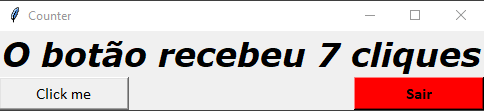
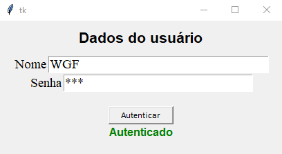

# Tkinter - Python

## Counter

> A Python interface was created for demonstrate how a Button works

## Auth interface

> A python interface that has buttons, inputs and labels. 
> 
> This works with logic to authenticate static login sample data.

### Author - Wanderson G. Fernandes

- [Instagram](https://instagram.com/locke._.wanderson?igshid=ZDc4ODBmNjlmNQ==)
- [LinkedIn](https://www.linkedin.com/in/wanderson-guedes-3138851aa)